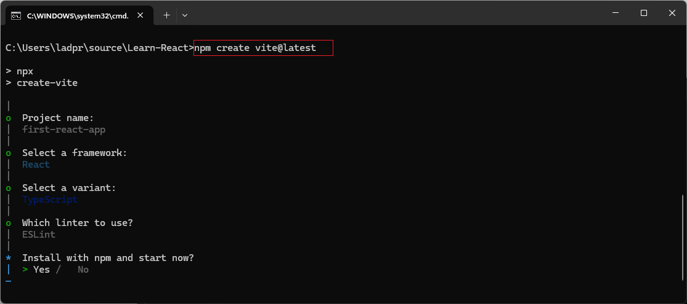
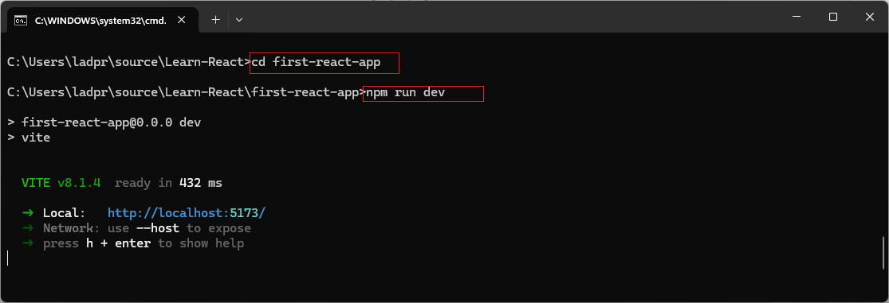

https://react.dev/learn/creating-a-react-app

# [Create React App](https://create-react-app.dev/docs/getting-started) #


### Create React App  build tool is deprecated  [See Reference](https://react.dev/blog/2025/02/14/sunsetting-create-react-app) 
### USE(https://vite.dev) Vite, Parcel, or RSBuild build tools to Create new React App

### `nodeJS` is required to use build tools like Vite, Parcel, or RSBuild.

# Install nodeJS

Install node.js Latest version from [Node.js](https://nodejs.org/en/download) official site.   
alternatively you can you `winget` to install nodeJS.
   
```cmd
winget install nodeJS
```
You can check the node version installed in your machine by running the following command that displays the node version as follows:

```
node -v
```

To unistall node.Js, use "winget" command in command prompt as below
```
winget uninstall nodejs
```

Learn mode about "winget"  [click here](https://learn.microsoft.com/en-us/windows/package-manager/winget/)


```
npx is a tool to run node packages without  installing binaries
```

# Create project using `**Vite**` 
create new project by running below command in cmd (you can chosse location where you want to create project)
```
npm create vite@latest
```

`create vite@latest`  cmd guide you create project in directory you chosse.
it will prompt for *Project Name*, *select a framework*, *select a variant* 



To run application, navigate to the project folder run `npm run dev` cmd


